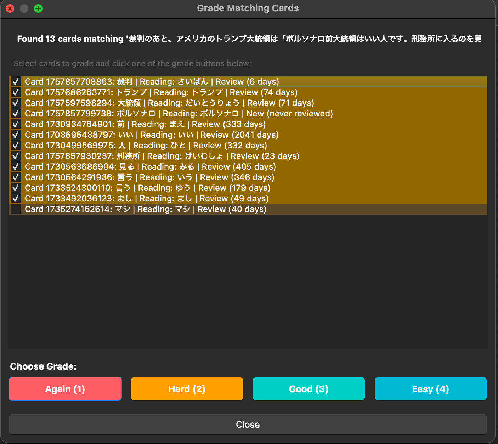

# Reviewer Grade Now - Anki Addon

This addon allows you to right-click on selected text in the Anki reviewer to find and grade matching cards.

## Features

- Right-click on any selected text in the reviewer
- Search for cards matching the selected text in a specified field (default: "Front")
- Grade multiple matching cards at once with Again/Hard/Good/Easy options
- Configurable search parameters

## How to Use

1. In the Anki reviewer, select any text on the current card
2. Right-click on the selected text
3. Choose "Grade matching cards: [selected text]" from the context menu
4. A dialog will show all cards that match the selected text
5. Select which cards you want to grade
6. Click one of the grade buttons: Again (1), Hard (2), Good (3), or Easy (4)

## Configuration

You can configure the addon through Anki's addon configuration:

- **target_deck**: Specific deck to search in (leave empty to search all decks)
- **search_field**: Field name to search in for matching text (default: "Front")
- **exact_match**: Whether to search for exact field matches only, no wildcards (default: true)

## Installation

1. Copy the addon files to your Anki addons directory
2. Restart Anki
3. The addon will be automatically loaded

## Requirements

- Anki 2.1+
- Compatible with desktop versions only

## Notes

- Only cards that are not suspended will be graded
- The addon will save changes to your collection after grading
- Exact matches and MeCab base-form matches are checked by default; token or partial matches are unchecked by default
